[This tutorial is still being written]

# Learn Full-Stack Javascript Development with Loopback and Angular 6 for beginners.

Hello everyone, my name is Louis Moreau, I'm a Full Stack Engineer at [Goodeed](https://www.goodeed.com).
In this tutorial, I'll try to teach you how to create a backend with a public API using Loopback 3 (NodeJS Framework) and a frontend using Angular 6.
As an example, we will work on a project to manage and display cooking recipes.
First, we will develop a backend with a public API to create, read, update and delete the recipes.
Then, we will use Angular 6 to develop a simple website that can display the cooking recipes.
You can checkout out this project's [Github repository](https://github.com/luisomoreau/learn-full-stack-javascript-development-for-beginners)


Here are the steps we will follow:

Backend:

* How to install the needed tools.

* How to create your models.

* How to link the models between each other.

* How to use the loopback filters.

* How to secure access to your API with ACLs.

* How to add custom logic to your models.

* How to create a custom API endpoint.

* How to deploy you project on [Heroku](https://www.heroku.com/) (or [Dokku](http://dokku.viewdocs.io/dokku/) or [Flynn](https://flynn.io/)).


Frontend:

* How to install the needed tools.

* How to create an Angular project.

* How to generate the services using the Loopback SDK Builder tool.


## Backend and public API


### Prerequisites

No prerequisites are needed for this tutorial, you just need to follow the steps. Do not hesitate to comment or to ask a question on Github if you feel lost, I'd be happy to answer as soon as possible.

### Needed Tools

For this tutorial you will need to install an IDE (Integrated Development Environment), I'm using [Webstorm](https://www.jetbrains.com/webstorm/) or [Atom](https://atom.io/) but feel free to use any other you feel comfortable with.
WebStorm comes with a 30-days free trial.
Hint: If you are a student, you can get a licence for free:
[Check it out here](https://www.jetbrains.com/student/).
Atom.io is free and open source.

#### Install Git

Here is the link to install git depending on your Operating System: [https://git-scm.com/book/en/v2/Getting-Started-Installing-Git](https://git-scm.com/book/en/v2/Getting-Started-Installing-Git).

#### Install NodeJS

At the time I'm writing the tutorial, the LTS (Long Term Support) version of NodeJS is 10.15:

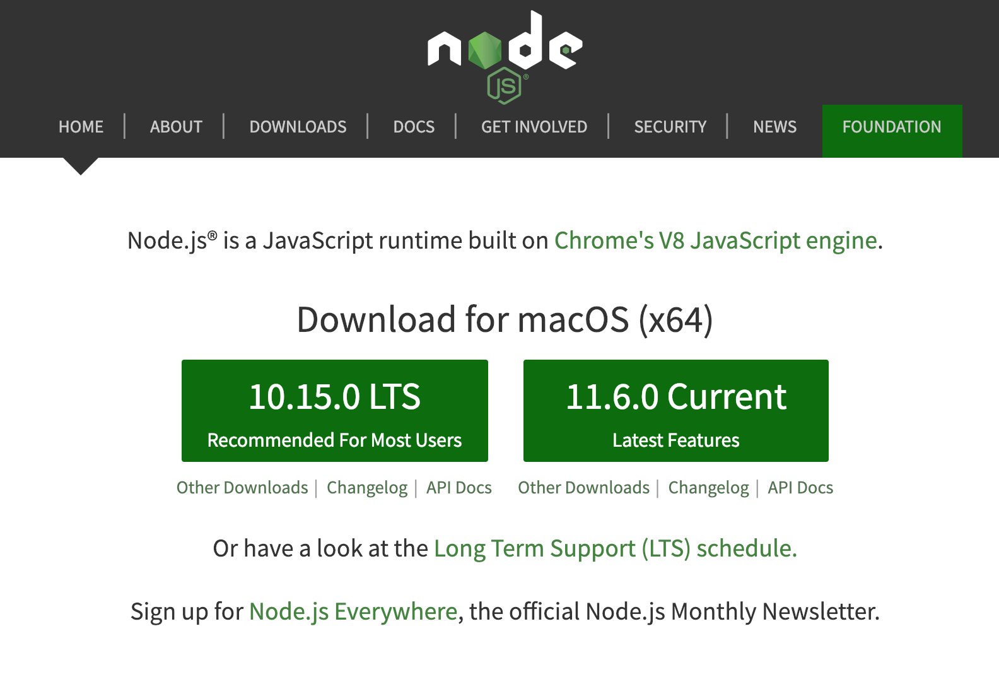

To install nodeJS, we will use nvm (Node Version Manager). NVM will give us the possibility to switch node version depending on our needs.

* Install nvm on Windows:
[https://github.com/coreybutler/nvm-windows](https://github.com/coreybutler/nvm-windows).

* Install nvm on macOS or Linux: [https://github.com/creationix/nvm](https://github.com/creationix/nvm).
Basically, you just need to run the following command:
```
wget -qO- https://raw.githubusercontent.com/creationix/nvm/v0.34.0/install.sh | bash
```
Don't forget to close your terminal and reopen it or use source to reload it:
```
$> source ~/.bash_profile
```

Then, run:

```
$> nvm install 10.15
$> nvm use 10.15
```


#### Install MongoDB

In this tutorial, we will use MongoDB 3.6 Community Edition.

* Install on Linux:
Install MongoDB Community Edition and required dependencies on Linux:
[https://docs.mongodb.com/v3.6/administration/install-on-linux/](https://docs.mongodb.com/v3.6/administration/install-on-linux/).

* Install on macOS:
Install MongoDB Community Edition on macOS systems from Homebrew packages or from MongoDB archives.
The easiest is it you Homebrew:
```
$> brew update
$> brew install mongodb
```

* Install on Windows:
Install MongoDB Community Edition on Windows systems and optionally start MongoDB as a Windows service:
[https://docs.mongodb.com/v3.6/tutorial/install-mongodb-on-windows/](https://docs.mongodb.com/v3.6/tutorial/install-mongodb-on-windows/).

### Loopback
#### Install Loopback

Install Loopback globally (the -g option will install the npm - Node Packet Manager - globally, it means, the loopback command  "lb" will be accessible anywhere in your system).

```
npm install -g loopback-cli
```

Start a new project

```
lb
```

Follow the prompt:
```
Louiss-MacBook-Pro:sources louis$ lb
? What's the name of your application? backend
? Enter name of the directory to contain the project: backend

   create backend/
     info change the working directory to backend

? Which version of LoopBack would you like to use? 3.x (Active Long Term Support)
? What kind of application do you have in mind? (Use arrow keys)
❯ api-server (A LoopBack API server with local User auth)
  empty-server (An empty LoopBack API, without any configured models or datasources)
  hello-world (A project containing a controller, including a single vanilla Message and a single remote method)
  notes (A project containing a basic working example, including a memory database)

```

Move into the created directory:
```
$> cd backend
```

Install dependencies:
```
npm install
```

Start the project:
```
npm start
```

At this stage, you should be able to access the Loopback Explorer to see the generated routes for your API:

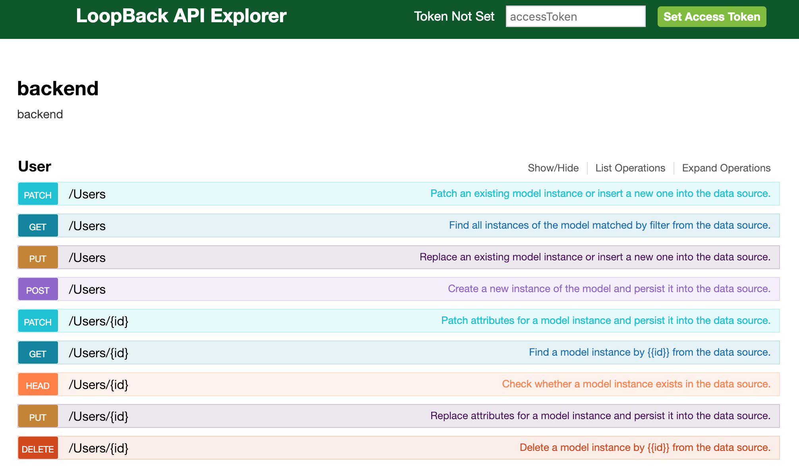

Note that because you chose to create an "api-server" project, loopback created for you an API including a User model and an authentication method.

#### Typescript

Just before seeing the database and the models, I'll pause this tutorial for the ones interested in using Loopback with Typescript.
I won't be able to explain all the benefits of Typescript in this tutorial but I'll just quote [Paul Dixon](https://stackoverflow.com/users/6521/paul-dixon)'s answer on Stack Overflow:

> [TypeScript](http://www.typescriptlang.org/) is a superset of JavaScript which primarily provides optional static typing, classes and interfaces. One of the big benefits is to enable IDEs to provide a richer environment for spotting common errors as you type the code.

> To get an idea of what I mean, watch [Microsoft's introductory video](http://channel9.msdn.com/posts/Anders-Hejlsberg-Introducing-TypeScript) on the language.

> For a large JavaScript project, adopting TypeScript might result in more robust software, while still being deployable where a regular JavaScript application would run.

> It is open source, but you only get the clever Intellisense as you type if you use a supported IDE. Initially, this was only Microsoft's Visual Studio (also noted in blog post from [Miguel de Icaza](http://tirania.org/blog/archive/2012/Oct-01.html)). These days, [other IDEs offer TypeScript support too](https://github.com/Microsoft/TypeScript/wiki/TypeScript-Editor-Support).

> Are there other technologies like it?
There's [CoffeeScript](http://coffeescript.org/), but that really serves a different purpose. IMHO, CoffeeScript provides readability for humans, but TypeScript also provides deep readability for tools through its optional static typing (see [this recent blog post](http://www.hanselman.com/blog/WhyDoesTypeScriptHaveToBeTheAnswerToAnything.aspx) for a little more critique). There's also [Dart](http://en.wikipedia.org/wiki/Dart_%28programming_language%29) but that's a full on replacement for JavaScript (though it [can produce JavaScript code](http://www.dartlang.org/docs/dart-up-and-running/contents/ch04-tools-dart2js.html)).

> Example
As an example, here's some TypeScript (you can play with this in the [TypeScript Playground](http://www.typescriptlang.org/Playground/))
> ```
class Greeter {
    greeting: string;
    constructor (message: string) {
        this.greeting = message;
    }
    greet() {
        return "Hello, " + this.greeting;
    }
}
```
And here's the JavaScript it would produce
> ```
var Greeter = (function () {
    function Greeter(message) {
        this.greeting = message;
    }
    Greeter.prototype.greet = function () {
        return "Hello, " + this.greeting;
    };
    return Greeter;
})();
```

> Notice how the TypeScript defines the type of member variables and class method parameters. This is removed when translating to JavaScript, but used by the IDE and compiler to spot errors, like passing a numeric type to the constructor.

> It's also capable of inferring types which aren't explicitly declared, for example, it would determine the greet() method returns a string.

> Debugging Typescript
Many browsers and IDEs offer direct debugging support through sourcemaps. See this Stack Overflow question for more details: [Debugging TypeScript code with Visual Studio](https://stackoverflow.com/questions/12711826/debugging-typescript-code-with-visual-studio).

Source: [https://stackoverflow.com/questions/12694530/what-is-typescript-and-why-would-i-use-it-in-place-of-javascript](https://stackoverflow.com/questions/12694530/what-is-typescript-and-why-would-i-use-it-in-place-of-javascript)

In short, using TypeScript avoid making many mistakes while writting your code, you can code faster and have a better understanding of the code produced by you and others.

I wrote few month ago a [Loopback TypeScript Boilerplate](https://github.com/luisomoreau/loopback3-typescript-boilerplate). If you want to use it, it is a Loopback application with a User model (like the application we've just created) but it has TypeScript already configured.

Otherwise, I will show you have to configure TypeScript with our new application. Just follow the next steps:

* Install @types/node using npm:
```
?> npm install --save @types/node
?> npm install --save @mean-expert/boot-script
?> npm install --save @mean-expert/model
?> npm install --save ts-node
?> npm install --save typescript
```
or just replace your package.json file by this one:
```
{
  "name": "recipes",
  "author": "Louis Moreau",
  "version": "1.0.0",
  "main": "server/server.js",
  "engines": {
    "node": ">=8.12.0",
    "npm": ">=6.4.1"
  },
  "scripts": {
    "lint": "eslint .",
    "start": "node .",
    "posttest": "npm run lint",
    "compile": "tsc && copyfiles \"server/**/*.json\" build/server -u 1"
  },
  "dependencies": {
    "@mean-expert/boot-script": "^1.0.0",
    "@mean-expert/model": "^1.0.9",
    "@types/node": "^11.13.2",
    "compression": "^1.0.3",
    "cors": "^2.5.2",
    "helmet": "^3.10.0",
    "loopback": "^3.22.0",
    "loopback-boot": "^2.6.5",
    "loopback-component-explorer": "^6.2.0",
    "loopback-connector-mongodb": "^3.9.2",
    "serve-favicon": "^2.0.1",
    "strong-error-handler": "^3.0.0",
    "ts-node": "^7.0.1",
    "typescript": "^3.1.4"
  },
  "devDependencies": {
    "eslint": "^3.17.1",
    "eslint-config-loopback": "^8.0.0"
  },
  "repository": {
    "type": "",
    "url": ""
  },
  "license": "UNLICENSED",
  "description": "recipes"
}
```
If you copied the package.json, remove you node_modules/ folder and run ```npm install```


* Add the following file at the backend root:
backend/tsconfig.json:
```
{
  "compilerOptions": {
    "target": "es2017",
    "module": "commonjs",
    "noImplicitAny": true,
    "removeComments": true,
    "preserveConstEnums": true,
    "sourceMap": true,
    "experimentalDecorators": true,
    "moduleResolution": "node",
    "typeRoots": [
      "./node_modules/@types"
    ],
    "types": [
      "node"
    ]
  }
}
```

* Finally, edit your server.js and add the following line under 'use strict':
```
require('ts-node/register');
```

All set, we are ready to continue the tutorial.
In this Typescript part, I do not expect you to understand everything we did, it is a more advanced level.

#### Database: Loopback MongoDB connector:

Before creating a model, we will add the loopback-connector-mongodb npm package to attach our future model to a mongo database:
Go in your application root repository and run:
```
npm install loopback-connector-mongodb --save
```
The --save parameter will save in the package.json file the instruction to install this package when you will need to install all the dependencies using npm install.

Now that the package is installed, we will need to configure the mongo datasource (server/datasources.json):
Go to your server repository and add the mongodb datasource as below:

```
{
  "db": {
    "name": "db",
    "connector": "memory"
  },
  "mongo": {
    "host": "localhost",
    "port": 27017,
    "url": "",
    "database": "recipesdb",
    "password": "",
    "name": "mongo",
    "user": "",
    "authSource": "",
    "connector": "mongodb"
  }
}
```

Let's have a look at the server/model-config.json file:

```
{
  "_meta": {
    "sources": [
      "loopback/common/models",
      "loopback/server/models",
      "../common/models",
      "./models"
    ],
    "mixins": [
      "loopback/common/mixins",
      "loopback/server/mixins",
      "../common/mixins",
      "./mixins"
    ]
  },
  "User": {
    "dataSource": "db"
  },
  "AccessToken": {
    "dataSource": "db",
    "public": false
  },
  "ACL": {
    "dataSource": "db",
    "public": false
  },
  "RoleMapping": {
    "dataSource": "db",
    "public": false,
    "options": {
      "strictObjectIDCoercion": true
    }
  },
  "Role": {
    "dataSource": "db",
    "public": false
  }
}
```

If you want to add manually another model or change its connector, you can do it in this file.
Here, I want my models to use the mongo connector instead of the memory connector. Let's change this:

```
{
  "_meta": {
    "sources": [
      "loopback/common/models",
      "loopback/server/models",
      "../common/models",
      "./models"
    ],
    "mixins": [
      "loopback/common/mixins",
      "loopback/server/mixins",
      "../common/mixins",
      "./mixins"
    ]
  },
  "User": {
    "dataSource": "mongo",
    "public": true
  },
  "AccessToken": {
    "dataSource": "mongo",
    "public": true
  },
  "ACL": {
    "dataSource": "mongo",
    "public": false
  },
  "RoleMapping": {
    "dataSource": "mongo",
    "public": false,
    "options": {
      "strictObjectIDCoercion": true
    }
  },
  "Role": {
    "dataSource": "mongo",
    "public": false
  }
}
```

### Generate a model:

```
lb model <ModelName>
```

Follow the instructions:

```
? Enter the model name: (ModelName) MyModel
? Select the datasource to attach MyModel to: (Use arrow keys)
❯ db (memory)
  mongo (mongodb)
  (no datasource)
? Select model's base class (Use arrow keys)
  Model
❯ PersistedModel
  ACL
  AccessToken
  Application
  Change
  Checkpoint
(Move up and down to reveal more choices)
? Expose MyModel via the REST API? (Y/n) Y
? Custom plural form (used to build REST URL): MyModels
? Common model or server only? (Use arrow keys)
❯ common
  server

Enter an empty property name when done.
? Property name: Name
```

Example with the Recipe model:

```
$> lb model Recipe
```
By convention, we name the model starting with a capital letter.

```
? Select the datasource to attach undefined to: mongo (mongodb)
? Select model's base class PersistedModel
? Expose Recipe via the REST API? Yes
? Custom plural form (used to build REST URL): Recipes
? Common model or server only? common
Let's add some Recipe properties now.

Enter an empty property name when done.
? Property name: id
? Property type: string
? Required? No
? Default value[leave blank for none]:

Let's add another Recipe property.
Enter an empty property name when done.
? Property name: name
? Property type: string
? Required? Yes
? Default value[leave blank for none]:

Let's add another Recipe property.
Enter an empty property name when done.
? Property name: description
? Property type: string
? Required? No
? Default value[leave blank for none]:

Let's add another Recipe property.
Enter an empty property name when done.
? Property name: guideLines
? Property type: string
? Required? No
? Default value[leave blank for none]:

Let's add another Recipe property.
Enter an empty property name when done.

? Property name: preparationTime
? Property type: string
? Required? No
? Default value[leave blank for none]:

Let's add another Recipe property.
Enter an empty property name when done.
? Property name: cookingTime
? Property type: string
? Required? No
? Default value[leave blank for none]:

Let's add another Recipe property.
Enter an empty property name when done.
? Property name: tips
? Property type: string
? Required? No
? Default value[leave blank for none]:

Let's add another Recipe property.
Enter an empty property name when done.
? Property name: image
? Property type: string
? Required? No
? Default value[leave blank for none]:


```

We will try to see in the Loopback Explorer our new Recipe model:

If you come across this error:
```
MongoNetworkError: failed to connect to server [localhost:27017] on first connect [MongoNetworkError: connect ECONNREFUSED 127.0.0.1:
27017]
```
It means that your mongodb service is not running.
On macOS, you can start the service with:
```
$> brew services mongodb
```

Then run again:
```
$> npm start
```
Open the explorer [http://localhost:3000/explorer](http://localhost:3000/explorer). You should now see your new model API routes:

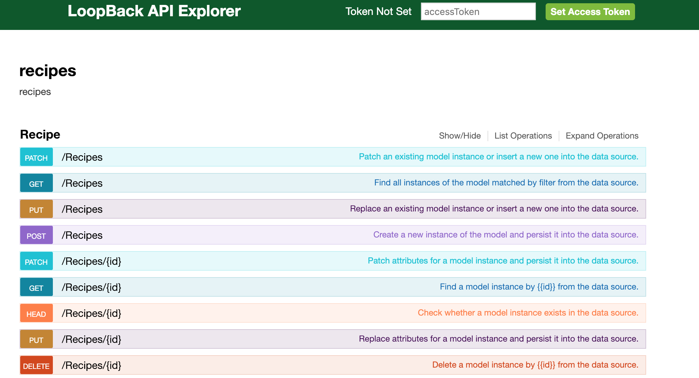

To check if it works you can run:
```
$> curl http://localhost:3000/api/Recipes/
// the response should be an empty array: []
```

Now try to POST a cookies recipe:

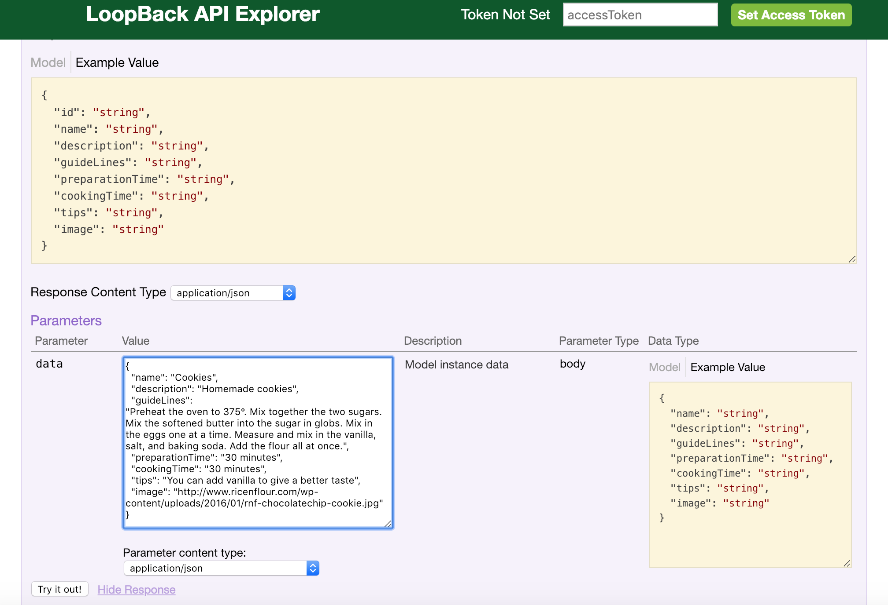

```
{"name":"Cookies",
"description":"Homemade cookies",
"guideLines":"Preheat the oven to 200°C. Mix together the two sugars. Mix the softened butter into the sugar in globs. Mix in the eggs one at a time. Measure and mix in the vanilla, salt, and baking soda. Add
the flour all at once.",
"preparationTime":"30 minutes",
"cookingTime":"30 minutes",
"tips":"You can add vanilla to give a better taste",
"image":"https://raw.githubusercontent.com/luisomoreau/learn-full-stack-javascript-development-for-beginners/master/assets/cookies-sweets-food-dessert-delicious-snack-sugar.jpg"}
```

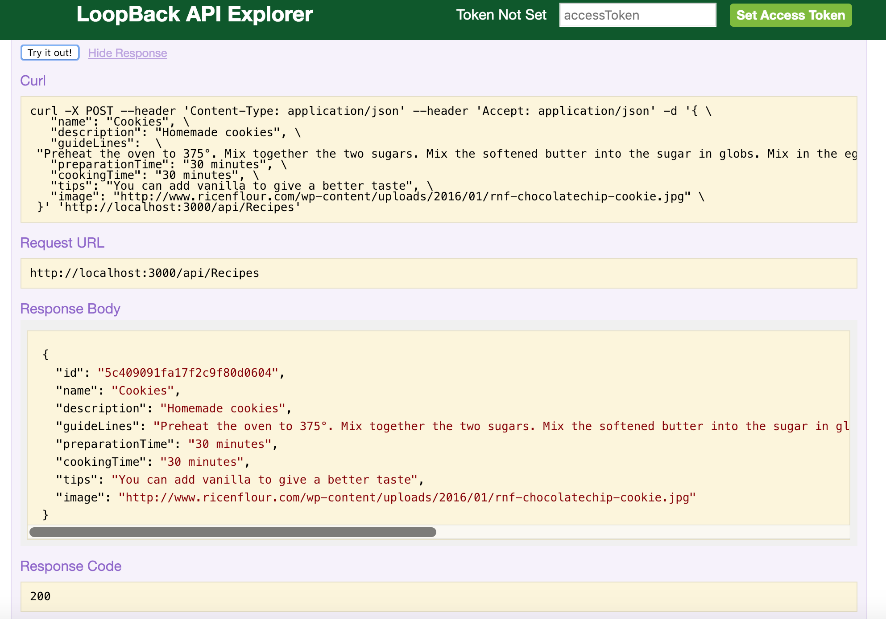

Run again:
```
$> curl http://localhost:3000/api/Recipes/
// the response should be an array: [{"id":"5c409091fa17f2c9f80d0604","name":"Cookies","description":"Homemade cookies","guideLines":"Preheat the oven to 200°C. Mix together the two sugars. Mix the softened butter into the sugar in globs. Mix in the eggs one at a time. Measure and mix in the vanilla, salt, and baking soda. Add
the flour all at once.","preparationTime":"30 minutes","cookingTime":"30 minutes","tips":"You can add vanilla to give a better taste","image":"https://raw.githubusercontent.com/luisomoreau/learn-full-stack-javascript-development-for-beginners/master/assets/cookies-sweets-food-dessert-delicious-snack-sugar.jpg"}]
```

Here we go! We have our first model working!
However, we still need to add our ingredients, change few things in our Recipe model, etc...

Let's open our Recipe model in common/models/recipe.json and see how it looks.

```
{
  "name": "Recipe",
  "plural": "Recipes",
  "base": "PersistedModel",
  "idInjection": true,
  "options": {
    "validateUpsert": true
  },
  "properties": {
    "id": {
      "type": "string"
    },
    "name": {
      "type": "string",
      "required": true
    },
    "description": {
      "type": "string"
    },
    "guideLines": {
      "type": "string"
    },
    "preparationTime": {
      "type": "string"
    },
    "cookingTime": {
      "type": "string"
    },
    "tips": {
      "type": "string"
    },
    "image": {
      "type": "string"
    }
  },
  "validations": [],
  "relations": {},
  "acls": [],
  "methods": {}
}
```

I'm not very happy with the guideLines property. I think it would be better to have an array of strings so let's change it:

Replace:
```
"guideLines": {
  "type": "string"
},
```
By:
```
"guideLines": ["string"],
```

Don't worry about the relations and acls fields by now, we will have a look at it after.

As you see, we can change anything within the code so don't worry if you need to add more properties or if you want to change their types. However, be careful when you change the model's properties. It may break your application...
In our case, we need to delete our cookies recipe because the "string" type is incompatible with ["string"].
If you want to add the cookies recipes with and array of guideLines, you can use this recipe:
```
{"name":"Cookies",
"description":"Homemade cookies",
"guideLines":[
"Preheat the oven to 200°C.",
"Mix together the two sugars.",
"Mix the softened butter into the sugar in globs.",
"Mix in the eggs one at a time.",
"Measure and mix in the vanilla, salt, and baking soda.", "Add the flour all at once."],
"preparationTime":"30 minutes",
"cookingTime":"30 minutes",
"tips":"You can add vanilla to give a better taste",
"image":"https://raw.githubusercontent.com/luisomoreau/learn-full-stack-javascript-development-for-beginners/master/assets/cookies-sweets-food-dessert-delicious-snack-sugar.jpg"}
```

Restart the API to see the changes in the Explorer:
(ctrl + c to exit)
```
npm start
```


#### Relations

Now we want to add a relation between ingredients and a recipe. First, we will create our ingredient model:

```
$> lb model Ingredient
```

```
? Select the datasource to attach undefined to: mongo (mongodb)
? Select model's base class PersistedModel
? Expose Recipe via the REST API? Yes
? Custom plural form (used to build REST URL): Ingredients
? Common model or server only? common
Let's add some Recipe properties now.

Enter an empty property name when done.
? Property name: id
? Property type: string
? Required? No
? Default value[leave blank for none]:

Let's add another Recipe property.
Enter an empty property name when done.
? Property name: name
? Property type: string
? Required? Yes
? Default value[leave blank for none]:

Let's add another Recipe property.
Enter an empty property name when done.
? Property name: quantity
? Property type: number
? Required? Yes
? Default value[leave blank for none]:

Let's add another Recipe property.
Enter an empty property name when done.
? Property name: units
? Property type: string
? Required? No
? Default value[leave blank for none]:
```

Ok, now we have both our Recipe and Ingredient models. We need to link them.

An ingredient will belong to a recipe:

```
$> lb relation
```

```
? Select the model to create the relationship from: Ingredient
? Relation type: belongs to
? Choose a model to create a relationship with: Recipe
? Enter the property name for the relation: recipe
? Optionally enter a custom foreign key:
? Allow the relation to be nested in REST APIs: No
? Disable the relation from being included: No
```
Some options are available, just follow the prompt right now.

A recipe will have many ingredients:

```
$> lb relation
```

```
? Select the model to create the relationship from: Recipe
? Relation type: has many
? Choose a model to create a relationship with: Ingredient
? Enter the property name for the relation: ingredients
? Optionally enter a custom foreign key:
? Require a through model? No
? Allow the relation to be nested in REST APIs: No
? Disable the relation from being included: No
```

Now open back our Recipe and Ingredient models:

```
{
  "name": "Ingredient",
  "plural": "Ingredients",
  "base": "PersistedModel",
  "idInjection": true,
  "options": {
    "validateUpsert": true
  },
  "properties": {
    "id": {
      "type": "string"
    },
    "name": {
      "type": "string"
    },
    "quantity": {
      "type": "number"
    },
    "unit": {
      "type": "string"
    }
  },
  "validations": [],
  "relations": {
    "recipe": {
      "type": "belongsTo",
      "model": "Recipe",
      "foreignKey": ""
    }
  },
  "acls": [],
  "methods": {}
}
```

```
{
  "name": "Recipe",
  "plural": "Recipes",
  "base": "PersistedModel",
  "idInjection": true,
  "options": {
    "validateUpsert": true
  },
  "properties": {
    "id": {
      "type": "string"
    },
    "name": {
      "type": "string",
      "required": true
    },
    "description": {
      "type": "string"
    },
    "guideLines": {
      "type": [
        "string"
      ]
    },
    "preparationTime": {
      "type": "string"
    },
    "cookingTime": {
      "type": "string"
    },
    "tips": {
      "type": "string"
    },
    "image": {
      "type": "string"
    }
  },
  "validations": [],
  "relations": {
    "ingredients": {
      "type": "hasMany",
      "model": "Ingredient",
      "foreignKey": ""
    }
  },
  "acls": [],
  "methods": {}
}
```

How does it look in the explorer?

Restart the API to see the changes in the Explorer:
(ctrl + c to exit)
```
npm start
```


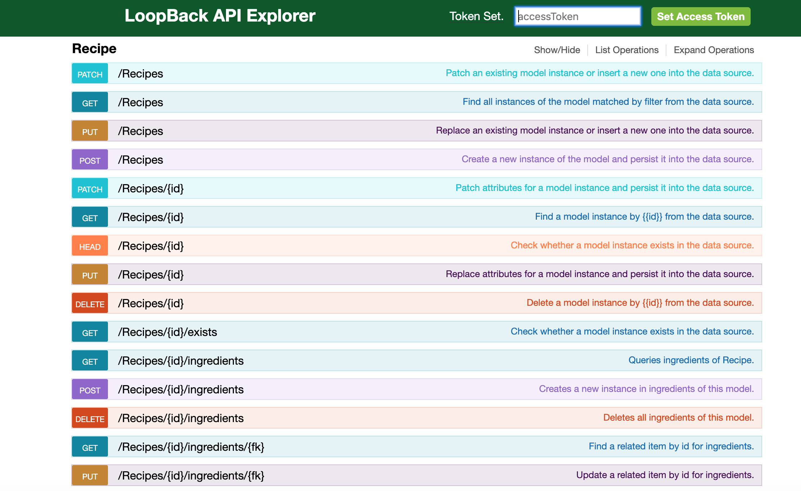

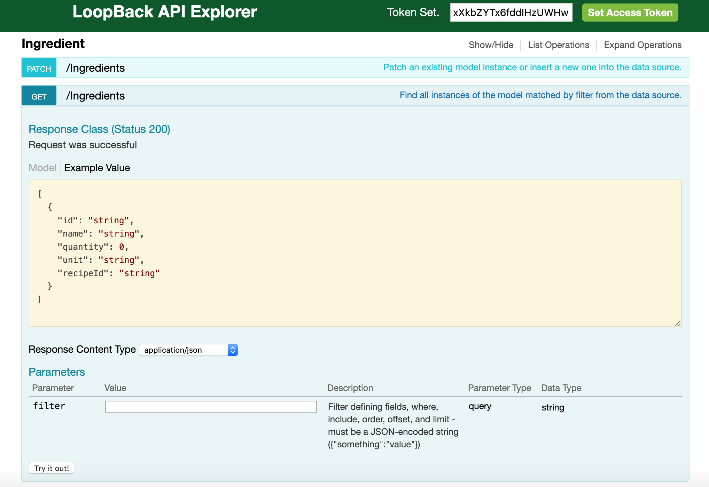

As you can see, in the Ingredient model, a new property appeared: recipeId, which is the foreign key.

To create a new ingredient linked with the cookie recipe, we need to add the recipe id in the ingredient property. In my case it will be:

```
{
  "name": "Eggs",
  "quantity": 2,
  "unit": "piece",
  "recipeId": "5cac667fbcd943a6690cbf3f"
}
```
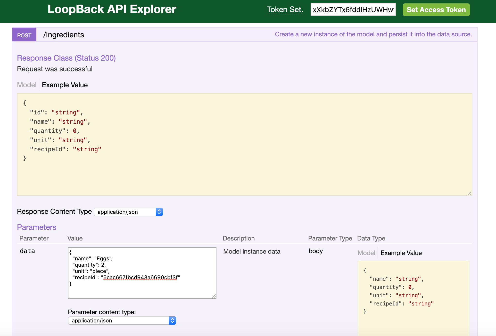

Note that in the models (ingredient.json for example), you have an option:
```
"idInjection": true,
```
This option generates an ID, you can set it to false if you want to set manually the IDs but I would not recommend it.

#### Loopback filters

You can find all the needed documentation about Loopback filters here:
[https://loopback.io/doc/en/lb3/Querying-data.html](https://loopback.io/doc/en/lb3/Querying-data.html)

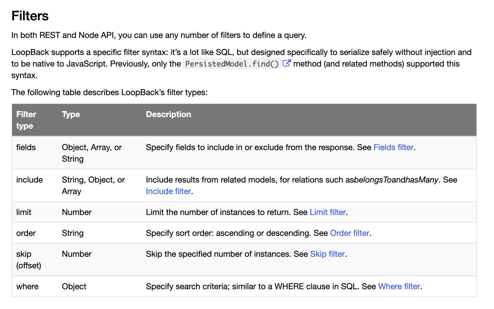

Let's see the include filter to get the cookies recipe with the ingredients:

Go back to the explorer to get the recipes and add the following filter:
```
{"include":"ingredients"}
```
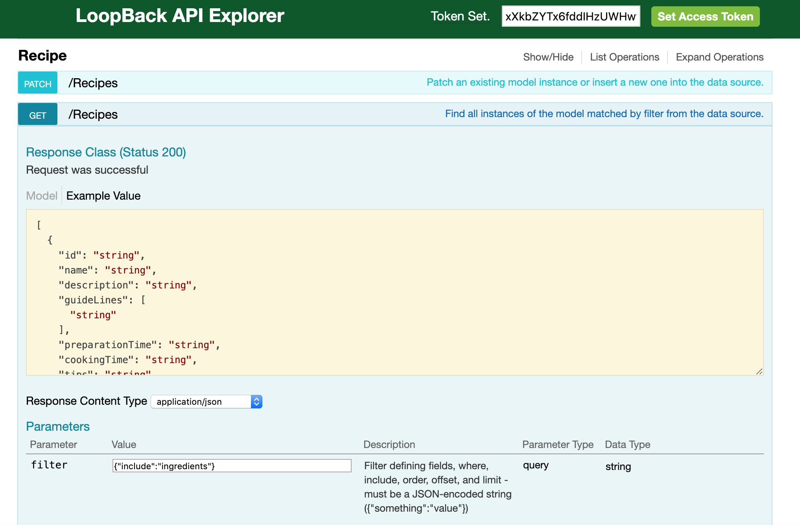

You will see in the response that the associated ingredients are included in an array:
```
[
  {
    "id": "5cac667fbcd943a6690cbf3f",
    "name": "Cookies",
    "description": "Homemade cookies",
    "guideLines": [
      "Preheat the oven to 200°C.",
      "Mix together the two sugars.",
      "Mix the softened butter into the sugar in globs.",
      "Mix in the eggs one at a time.",
      "Measure and mix in the vanilla, salt, and baking soda.",
      "Add the flour all at once."
    ],
    "preparationTime": "30 minutes",
    "cookingTime": "30 minutes",
    "tips": "You can add vanilla to give a better taste",
    "image": "https://raw.githubusercontent.com/luisomoreau/learn-full-stack-javascript-development-for-beginners/master/assets/cookies-sweets-food-dessert-delicious-snack-sugar.jpg",
    "ingredients": [
      {
        "id": "5cac70f64df833a79f59ee65",
        "name": "Eggs",
        "quantity": 2,
        "unit": "piece",
        "recipeId": "5cac667fbcd943a6690cbf3f"
      }
    ]
  }
]
```

If you want to test this request using curl:
```
?> curl -X GET --header 'Accept: application/json' 'http://localhost:3000/api/Recipes?filter=%7B%22include%22%3A%22ingredients%22%7D'
```
We won't enter into details about the other filters but I invite you to take a look at the Loopback documentation.

#### Secure access to your API with ACLs:

By default, Loopback comes with a User model. The good practice is to create a user model (the only one starting with a lower case). The user model will inherit the User model:

Create this user model:
```
?> lb model users
```

```
? Enter the model name: user
? Select the datasource to attach user to: mongo (mongodb)
? Select model's base class User
? Expose user via the REST API? Yes
? Custom plural form (used to build REST URL): users
? Common model or server only? common
Let's add some user properties now.

Enter an empty property name when done.

? Property name:
```

Remove the User model from being public in server/model-config.json
```
{
  "_meta": {
    "sources": [
      "loopback/common/models",
      "loopback/server/models",
      "../common/models",
      "./models"
    ],
    "mixins": [
      "loopback/common/mixins",
      "loopback/server/mixins",
      "../common/mixins",
      "./mixins"
    ]
  },
  "User": {
    "dataSource": "db",
    "public": false
  },
  "AccessToken": {
    "dataSource": "mongo",
    "public": false
  },
  "ACL": {
    "dataSource": "db",
    "public": false
  },
  "RoleMapping": {
    "dataSource": "db",
    "public": false,
    "options": {
      "strictObjectIDCoercion": true
    }
  },
  "Role": {
    "dataSource": "db",
    "public": false
  },
  "Recipe": {
    "dataSource": "mongo",
    "public": true
  },
  "Ingredient": {
    "dataSource": "mongo",
    "public": true
  },
  "user": {
    "dataSource": "mongo",
    "public": true
  }
}
```

Let's add a relation between the Recipe and the user models:

* One Recipe belongs to a user:
```
?> lb relations
```

```
? Select the model to create the relationship from: Recipe
? Relation type: belongs to
? Choose a model to create a relationship with: user
? Enter the property name for the relation: user
? Optionally enter a custom foreign key:
? Allow the relation to be nested in REST APIs: No
? Disable the relation from being included: No
```

* One user has many Recipes:
```
?> lb relations
```

```
? Select the model to create the relationship from: user
? Relation type: has many
? Choose a model to create a relationship with: Recipe
? Enter the property name for the relation: recipes
? Optionally enter a custom foreign key:
? Require a through model? No
? Allow the relation to be nested in REST APIs: No
? Disable the relation from being included: No
```

Now we will deny all requests and open them step by step:

```
?> lb acl
```

```
? Select the model to apply the ACL entry to: (all existing models)
? Select the ACL scope: All methods and properties
? Select the access type: All (match all types)
? Select the role All users
? Select the permission to apply Explicitly deny access
```

Go back in the explorer and try to Get the recipes, you will see the following error:
```
{
  "error": {
    "statusCode": 401,
    "name": "Error",
    "message": "Authorization Required",
    "code": "AUTHORIZATION_REQUIRED",
    "stack": "Error: Authorization Required ..."
  }
}
```

Open the common/models/recipe.json file, you will see that the acls have been added:
```
"acls": [
  {
    "accessType": "*",
    "principalType": "ROLE",
    "principalId": "$everyone",
    "permission": "DENY"
  }
],
```

Open the READ permission for the models Recipe and Ingredient:

```
?> lb acl
```

```
? Select the model to apply the ACL entry to: Recipe
? Select the ACL scope: All methods and properties
? Select the access type: Read
? Select the role All users
? Select the permission to apply Explicitly grant access
```

Do the same for the Ingredient model:
```
?> lb acl
```

```
? Select the model to apply the ACL entry to: Ingredient
? Select the ACL scope: All methods and properties
? Select the access type: Read
? Select the role All users
? Select the permission to apply Explicitly grant access
```

Now we will set a WRITE permission for the owner of the recipe:
```
?> lb acl
```

```
? Select the model to apply the ACL entry to: Recipe
? Select the ACL scope: All methods and properties
? Select the access type: Write
? Select the role The user owning the object
? Select the permission to apply Explicitly grant access
```
This WRITE permission will allow the owner of the recipe to udpate it or to delete it.

Restart the API to see the changes in the Explorer:
(ctrl + c to exit)
```
npm start
```

Now you can read again all the recipes. However, you cannot create a new one. Let's add another ACL on the property create:
```
?> lb acl
```

```
? Select the model to apply the ACL entry to: Recipe
? Select the ACL scope: A single method
? Enter the method name create
? Select the role Any authenticated user
? Select the permission to apply Explicitly grant access
```

Let's do the same for the Ingredient model:
```
?> lb acl
```

```
? Select the model to apply the ACL entry to: Ingredient
? Select the ACL scope: A single method
? Enter the method name create
? Select the role Any authenticated user
? Select the permission to apply Explicitly grant access
```

Restart the API and try to add a new recipe.
It won't work because only authenticated users can.

So let's add a new user.

In the explorer go under /users, choose POST and add your credentials:
```
{
  "email": "louis@luisomoreau.com",
  "password": "mysuperpassword"
}
```
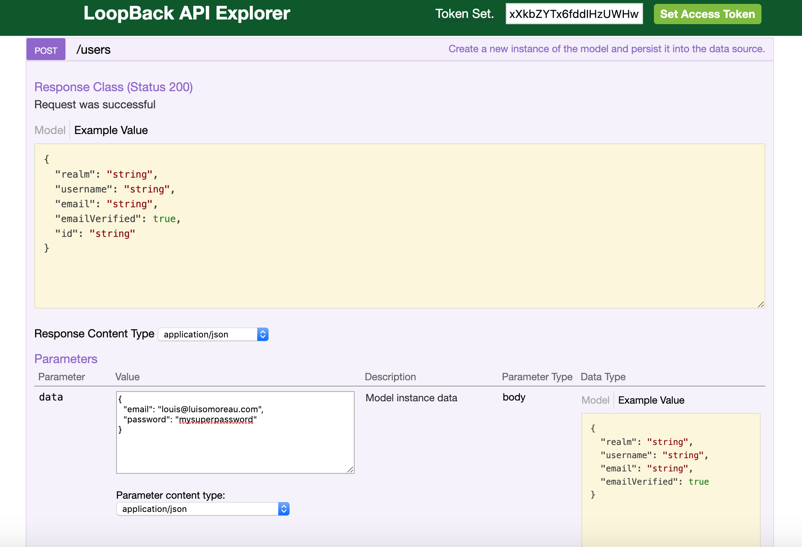

Then use the login function under /users/login and add your credentials:

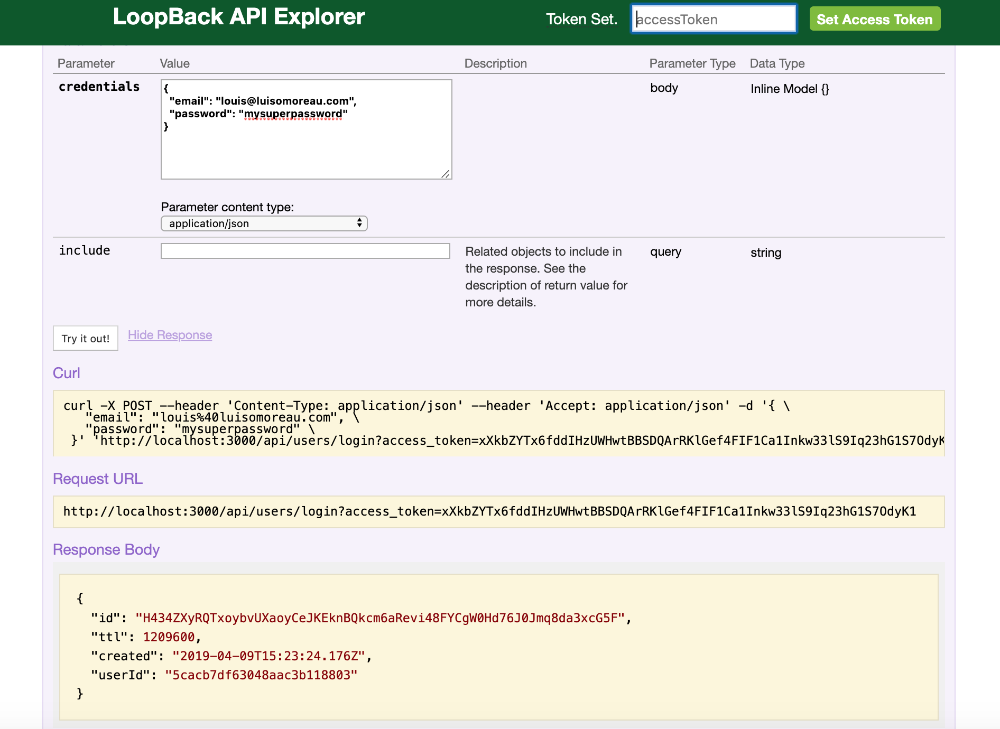

The response will come with an id, this is the AccessToken to authenticate requests.
Copy and past it in the accessToken input field in the header:


Now you can create a new recipe!

Post again the same recipe as before, just change the name and ** do not forget to add your userId property if you want to be able to edit it after.**

If you forget it, the relation between the Recipe and the user won't be made, thus there will be no owner of this recipe. Consequently, the permission won't be granted:
```
{
  "name": "Super Cookies",
  "description": "Homemade cookies",
  "guideLines": [
    "Preheat the oven to 200°C.",
    "Mix together the two sugars.",
    "Mix the softened butter into the sugar in globs.",
    "Mix in the eggs one at a time.",
    "Measure and mix in the vanilla, salt, and baking soda.",
    "Add the flour all at once."
  ],
  "preparationTime": "30 minutes",
  "cookingTime": "30 minutes",
  "tips": "You can add vanilla to give a better taste",
  "image": "https://raw.githubusercontent.com/luisomoreau/learn-full-stack-javascript-development-for-beginners/master/assets/cookies-sweets-food-dessert-delicious-snack-sugar.jpg",
  "userId": "5cacb7df63048aac3b118803"
}
```

#### Add custom logic to your models

Because it is annoying to add the userId to the recipes, we will add it in a beforeSave hook. The idea is to go an check the associated user to the accessToken and add it the recipe.

Open the common/models/recipe.ts file:

```
import {Model} from '@mean-expert/model';
/**
 * @module recipe
 * @description
 **/
@Model({
  hooks: {
    access: {name: 'access', type: 'operation'},
    persist: {name: 'persist', type: 'operation'},
    beforeSave: {name: 'before save', type: 'operation'},
    afterSave: {name: 'after save', type: 'operation'},
    beforeDelete: {name: 'before delete', type: 'operation'},
    afterDelete: {name: 'after delete', type: 'operation'},
    beforeMyRemote: {name: 'myRemote', type: 'beforeRemote'},
    afterMyRemote: {name: 'myRemote', type: 'afterRemote'},
  },
  remotes: {
    myRemote: {
      returns: {arg: 'result', type: 'array'},
      http: {path: '/my-remote', verb: 'get'}
    }
  }
})

class Recipe {
  constructor(public model: any) {
  }

  access(ctx: any, next: Function): void {
    console.log('recipe: access');
    next();
  }

  persist(ctx: any, next: Function): void {
    console.log('recipe: persist');
    next();
  }

  beforeSave(ctx: any, next: Function): void {
    console.log('recipe: before Save');
    next();
  }

  afterSave(ctx: any, next: Function): void {
    console.log('recipe: before Save');
    next();
  }

  beforeDelete(ctx: any, next: Function): void {
    console.log('recipe: before Delete');
    next();
  }

  afterDelete(ctx: any, next: Function): void {
    console.log('recipe: after Delete');
    next();
  }

  beforeMyRemote(ctx: any, next: Function) {
    console.log('recipe: before myRemote');
    next();
  }

  myRemote(next: Function): void {
    console.log('recipe: myRemote');
    this.model.find(next);
  }

  afterMyRemote(ctx: any, next: Function) {
    console.log('recipe: after myRemote');
    next();
  }

}

module.exports = Recipe;
```

You will see the beforeSave function has two arguments, the context and a callback.
If you log the ctx, it has many properties.

We will be interested in the ctx.options.accessToken object, isNewInstance (to differenciate updates from creates) and the instance object (which contains the data we want to save):

```
instance:
   { name: 'Super Cookies',
     description: 'Homemade cookies',
     guideLines:
      List [
        'Preheat the oven to 200°C.',
        'Mix together the two sugars.',
        'Mix the softened butter into the sugar in globs.',
        'Mix in the eggs one at a time.',
        'Measure and mix in the vanilla, salt, and baking soda.',
        'Add the flour all at once.' ],

     preparationTime: '30 minutes',
     cookingTime: '30 minutes',
     tips: 'You can add vanilla to give a better taste',
     image:
      'https://raw.githubusercontent.com/luisomoreau/learn-full-stack-javascript-development-for-beginners/master/assets/cookies-sweets-food-dessert-delicious-snack-sugar.jpg' },
  isNewInstance: true,
  hookState: {},
  options:
   { prohibitHiddenPropertiesInQuery: true,
     maxDepthOfQuery: 12,
     maxDepthOfData: 32,
     accessToken:
      { ttl: 1209600,
        created: 2019-04-09T15:23:24.176Z,
        userId: 5cacb7df63048aac3b118803,
        id:
         'H434ZXyRQTxoybvUXaoyCeJKEknBQkcm6aRevi48FYCgW0Hd76J0Jmq8da3xcG5F' },
     authorizedRoles: { '$everyone': true, '$authenticated': true }
     }
   }
```

So, modify the beforeSave function to add this:

```
beforeSave(ctx: any, next: Function): void {
  // console.log('recipe: before Save', ctx);
  if(ctx.isNewInstance){
    ctx.instance.userId = ctx.options.accessToken.userId;
  }
  next();
}
```

Reload the API and try to post a new recipe without the userId parameter, you will see in the response that the userId has been added based on your accessToken.

Note that you can delete the unwanted hooks if you don't use them.

Also note that you could use mixins to perform this operation but we won't see them in this tutorial. If you are interested in learning how to use the mixins, check the [documentation](https://loopback.io/doc/en/lb3/Defining-mixins.html).
I often use the Timestamp mixin and for this specific use case, [YeeHaw1234](https://stackoverflow.com/users/386778/yeehaw1234) wrote an answer on [stackoverflow](https://stackoverflow.com/questions/45060346/loopback-authorize-a-user-to-see-only-his-data/45113745) on how to create an owner mixin.

#### Create a custom API endpoint.

Custom API endpoints are always needed at some point in your application development.
As an example, we will create the endpoint /api/Recipe/{id}/increment-views. This endpoint can be called once the recipe has been loaded on the application.

We start with adding a views property to our Recipe model.
I'll edit directly the common/models/recipe.json file and add the following property at the end of the properties object:

```
"views": {
  "type": "number",
  "default": 0
}
```

Open again the common/models/recipe.ts and change
```
remotes: {
  myRemote: {
    returns: {arg: 'result', type: 'array'},
    http: {path: '/my-remote', verb: 'get'}
  }
}
```
into
```
remotes: {
  incrementViews: {
    description: ["Increment a given recipe views"],
    returns: {arg: 'views', type: 'number'},
    http: {path: '/:id/increment-views', verb: 'get'},
    accepts: [
      {arg: "id", required: true, type: "string", http: {source: 'path'}, description: "Recipe Id"}
    ]
  }
}
```

As we don't need nor the beforeMyRemote and afterMyRemote functions, we will delete them and we change myRemote function
```
beforeMyRemote(ctx: any, next: Function) {
  console.log('recipe: before myRemote');
  next();
}

myRemote(next: Function): void {
  console.log('recipe: myRemote');
  this.model.find(next);
}

afterMyRemote(ctx: any, next: Function) {
  console.log('recipe: after myRemote');
  next();
}
```

with

```
incrementViews(id: string, next: Function): void {
  // console.log('recipe: myRemote');
  this.model.updateAll(
    {id: id},
    {'$inc': {views: 1}},
    {allowExtendedOperators: true},
    (err: any, result: any) => {
      if (err) {
        next(err);
      }
      // console.log(result);
      this.model.findById(id, {fields: {views: true}}, (err: any, instance: any) => {
        next(err, instance.views);
      })
    }
  );
}
```
We'll take some time to explain the code above:
The arguments id is the id of the recipe that we passed as an argument in the request.
The second argument next is the callback function. This next function is like next(error, data) and will return the error or the data in response of the API call.

this.model is the current model we are using, the Recipe model.

updateAll is a function belonging to the Recipe Model(and globally all the Persisted Models). See [here](http://apidocs.loopback.io/loopback/#persistedmodel-updateall) for more information.

Here we use the $inc method and as it is a MongoDB function, we had to specify ```{allowExtendedOperators: true}```. We are using this MongoDB function in case many requests arrive at the same time, the incrementation will be made. Otherwise if we were using something like get the model, increment the property and save the model, we could loose some data as many requests can be performed at the same time.

Then this function updateAll expects a callback, which is our ```(err: any, result: any) => {}```
Once our incrementation has been made, we get the last value of our views and we pass it back to the callback function (our next function).
